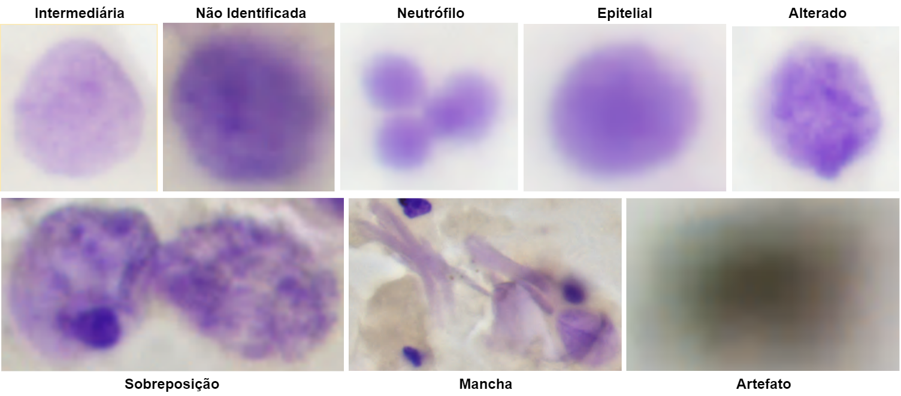

# CitoUFSC - Feulgen Nuclei Segmentation

*For the english version click <a href="https://codigos.ufsc.br/lapix/feulgen-segmentation/-/blob/master/README_EN.md">here<a>.

Este repositório contém os códigos-fonte referentes à alguns dos trabalhos do grupo de pesquisa do LAPIX (https://lapix.ufsc.br/) em citologia computacional. Estes códigos foram utilizados para processar o conjunto de dados de exames citológicos corados com o corante de Feulgen. O <i>dataset</i> pode ser encontrado no seguinte link: https://arquivos.ufsc.br/d/7e7ac2f498df4cf9aa7d/. A Figura abaixo apresenta uma visão geral da metodologia utilizada.


<h2>Código-Fonte</h2>
Este repositório contém três pastas:<br><br>

- <b>Classificacao</b>: nesta pasta estão contidos três arquivos: classification_34.ipynb, classification_50.ipynb e classification_101.ipynb. Eles foram utilizados para treinar a ResNet34, ResNet50 e ResNet101, respectivamente. Para o desenvolvimento e treinamento destes modelos foi utilizado o fast.ai (https://github.com/fastai/fastai);

- <b>DeteccaoDeObjetos</b>: esta pasta contém quatro arquivos: faster_rcnn_R_50_FPN_3x.ipynb, faster_rcnn_R_101_FPN_3x.ipynb, retinanet_R_50_FPN_3x.ipynb e retinanet_R_101_FPN_3x.ipynb. Eles foram utilizados para treinar a Faster R-CNN + ResNet50, a Faster R-CNN + ResNet101, a RetinaNet + ResNet50 e a RetinaNet + ResNet101, respectivamente. Para o desenvolvimento e treinamento destas redes neurais foi utilizado o <i>detectron2</i> (https://github.com/facebookresearch/detectron2);

- <b>SegmentacaoSemantica</b>: nesta pasta estão contidos quatro arquivos: segmentation_18.ipynb, segmentation_34.ipynb, weighted_segmentation_18.ipynb e weighted_segmentation_34.ipynb. Eles foram utilizados para treinar a U-Net + ResNet18, a U-Net + ResNet34, a Weighted U-Net + ResNet18 e a Weighted U-Net + ResNet34, respectivamente. O tempo "weighted" antes de cada nome indica que foram utilizados pesos diferentes para cada classe no cálculo da <i>loss function</i>, visando diminuir o efeito do desbalanceamento do conjunto de dados. Para treinamento e teste destas redes foi utilizado o fast.ai (https://github.com/fastai/fastai).

<h2>Conjunto de Dados</h2>
O conjunto de dados utilizado neste trabalho pode ser encontrado em: https://arquivos.ufsc.br/d/7e7ac2f498df4cf9aa7d/. Este <i>dataset</i> foi anotado contendo as seguintes classes (tipos de núcleos):

<b>1. Intermediários:</b> também conhecido como núcleo de referência. São aqueles que não possuem uma quantidade anormal de DNA;<br> 
<b>2. Alterados:</b> estes núcleos possuem alterações na quantificação de DNA;<br>
<b>3. Artefato (sujeira):</b> representam alguns artefatos de técnica que podem aparecer nas lâminas (geralmente uma mancha preta);<br> 
<b>4. Não Identificado:</b> representam os núcleos que geralmente estão fora de foco ou possuem uma quantidade baixa de corante;<br> 
<b>5. Epiteliais (velhas):</b> são os núcleos de células epiteliais que estão se separando da mucosa;<br> 
<b>6. Neutrófilo:</b> representa um neutrófilo (um tipo específico de célula de defesa);<br> 
<b>7. Sobreposição:</b> demonstra a sobreposição entre dois ou mais núcleos;<br> 
<b>8. Mancha:</b> denota um agrupamento contendo um grande número de células e/ou excesso de corante.<br> 

A Figura abaixo apresenta um exemplo visual de cada classe.



Ao acessar o repositório, serão encontrados dois arquivos:<br><br>
<b>- 1_OD_SS.zip:</b> ao extrair este arquivo, o diretório ficará estruturado da seguinte maneira: 
1. train/: contém o subconjunto de imagens utilizadas para o treinamento;
2. test/: contém o subconjunto de imagens utilizadas para o teste;
3. val/: contém o subconjunto de imagens utilizadas para a validação.

- Dentro de <b>cada</b> pasta haverão <b>mais três pastas</b>:
1. Images/: contém as imagens de determinado subconjunto em formato "png";
2. OD_Labels/: contém as anotações utilizadas para o treinamento das redes neurais de detecção de objetos;
3. SS_Labels/: contém as anotações utilizadas para o treinamento das redes neurais de segmentação semântica.

<b>- Image_Classification.zip:</b> este arquivo contém o conjunto de dados utilizados para treinar as redes neurais de classificação de imagem. Ao extrair este arquivo, o diretório ficará estruturado da seguinte maneira: 
1. train/: contém o subconjunto de imagens utilizadas para o treinamento;
2. test/: contém o subconjunto de imagens utilizadas para o teste;
3. valid/: contém o subconjunto de imagens utilizadas para a validação.

- Dentro de <b>cada</b> pasta, haverão mais oito pastas. São elas: alterada, intermediaria, mancha, nao_identificado, neutrofilo, sobreposicao, sujeira e velhas. Cada uma delas contém as amostras para cada classe presente no conjunto de dados. Dentro de cada uma estão localizadas as imagens (campos) no formato "png".

<h2>Mais informações</h2>
Para mais informações sobre a implementação e testes utilizando estas redes neurais e este conjunto de dados, verifique: <i>link disponível em breve</i>.<br><br>

Se estes códigos-fonte ou o conjunto de dados foi útil para a sua pesquisa, considere citar um dos seguintes trabalhos:
```BibTeX
@article{VICTORIAMATIAS2021101934,
title = {What is the state of the art of computer vision-assisted cytology? A Systematic Literature Review},
journal = {Computerized Medical Imaging and Graphics},
volume = {91},
pages = {101934},
year = {2021},
issn = {0895-6111},
doi = {https://doi.org/10.1016/j.compmedimag.2021.101934},
url = {https://www.sciencedirect.com/science/article/pii/S0895611121000835},
author = {André {Victória Matias} and João Gustavo {Atkinson Amorim} and Luiz Antonio {Buschetto Macarini} and Allan Cerentini and Alexandre Sherlley {Casimiro Onofre} and Fabiana Botelho {De Miranda Onofre} and Felipe Perozzo Daltoé and Marcelo Ricardo Stemmer and Aldo {von Wangenheim}}
```
```BibTeX
@MASTERSTHESIS {macarini2021thesis,
    author = "Luiz Antonio Buschetto Macarini",
    title  = "Utilização de Redes Neurais Convolucionais na detecção, segmentação e classificação de núcleos celulares para identificação de aneuploidia",
    school = "Universidade Federal de Santa Catarina",
    year   = "2021",
    type   = "Master Thesis",
    month  = "aug"
}
```

<b>Colaboradores:</b>
- Luiz Antonio Buschetto Macarini: luiz.buschetto@posgrad.ufsc.br;
- André Victória Matias: andre.v.matias@posgrad.ufsc.br;
- João Gustavo Atkinson Amorim: joao.atkinson@posgrad.ufsc.br;
- Allan Cerentini: allan.c@posgrad.ufsc.br;
- Prof. Aldo von Wangenheim: aldo.vw@ufsc.br. 
