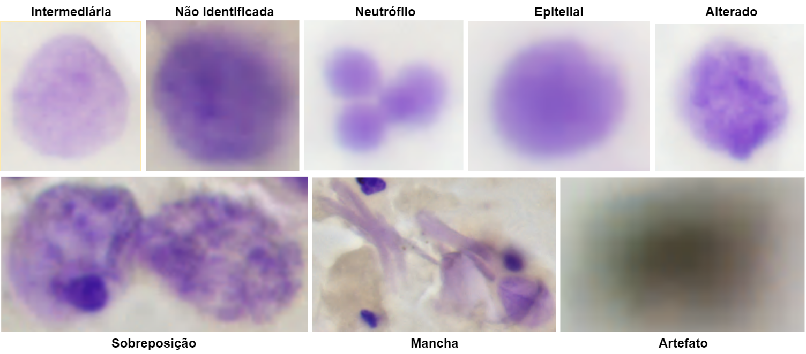

# CitoUFSC - Feulgen Nuclei Segmentation

*Para a versão em português clique <a href="https://codigos.ufsc.br/lapix/feulgen-segmentation/-/blob/master/README.md">aqui<a>.

This repository contains the source codes for some of the works of the LAPIX research group (https://lapix.ufsc.br/) in computational cytology. These codes were used to process the cytology dataset colored with Feulgen's stain. The dataset can be found at the following link: https://arquivos.ufsc.br/d/7e7ac2f498df4cf9aa7d/. The Figure following presents an overview of the methodology used.


<h2>Source Code</h2>
This repository contains three folders:<br><br>

- <b>Classificacao</b>: this folder contains three files: classification_34.ipynb, classification_50.ipynb and classification_101.ipynb. They were used to train ResNet34, ResNet50 and ResNet101 respectively. For the development and training of these models we used the fast.ai (https://github.com/fastai/fastai);

- <b>DeteccaoDeObjetos</b>: this folder contains four files: faster_rcnn_R_50_FPN_3x.ipynb, faster_rcnn_R_101_FPN_3x.ipynb, retinanet_R_50_FPN_3x.ipynb, and retinanet_R_101_FPN_3x.ipynb. They were used to train Faster R-CNN + ResNet50, Faster R-CNN + ResNet101, RetinaNet + ResNet50 and RetinaNet + ResNet101, respectively. For the development and training of these neural networks we used the <i>detectron2</i> (https://github.com/facebookresearch/detectron2);

- <b>SegmentacaoSemantica</b>: this folder contains four files: segmentation_18.ipynb, segmentation_34.ipynb, weighted_segmentation_18.ipynb, and weighted_segmentation_34.ipynb. They were used to train U-Net + ResNet18, U-Net + ResNet34, Weighted U-Net + ResNet18, and Weighted U-Net + ResNet34, respectively. The word "weighted" before each name indicates that different weights that were used for each class in the calculation of the loss function, in order to reduce the effect of the unbalanced dataset. The fast.ai (https://github.com/fastai/fastai) was used for training and testing these networks.

<h2>Dataset</h2>
The dataset used in this work can be found at: https://arquivos.ufsc.br/d/7e7ac2f498df4cf9aa7d/. This dataset was annotated containing the following classes (nuclei types):

<b>1. Intermediária:</b> also known as "reference nuclei". This represents the nuclei that doesn't have an abnormal amount of DNA;<br> 
<b>2. Alterado:</b> these nuclei have alterations in the DNA quantification;<br>
<b>3. Artefato (sujeira):</b> represent some technique's artifact that may appear on the slides (usually a black blob);<br> 
<b>4. Não Identificada:</b> represent nuclei that are generally out of focus or have a low amount of stain; <br> 
<b>5. Epitelial (velhas):</b> are the nuclei of epithelial cells that are separating from the mucosa;<br> 
<b>6. Neutrófilo:</b> represents a neutrophil (a specific type of defense cell); <br> 
<b>7. Sobreposição:</b> demonstrates the overlap between two or more nuclei;<br> 
<b>8. Mancha:</b> denotes a cluster/group containing a large number of cells and/or excess stain.<br> 

The Figure below presents a visual example of each class.



When accessing the repository, two files will be found:<br><br>
<b>- 1_OD_SS.zip:</b> when extracting this file, the directory will be structured as follows: 
1. train/: contains the subset of images used for training;
2. test/: contains the subset of images used for testing;
3. val/: contains the subset of images used for validation.

- Inside <b>each</b> folder there will be <b>three more folders</b>:
1. Images/: contains the images of a sime subset in "png" format;
2. OD_Labels/: contains the labels used for training the object detection neural networks;
3. SS_Labels/: contains the labels used for training the semantic segmentation neural networks.

<b>- Image_Classification.zip:</b> this file contains the dataset used to train the image classification neural networks. When extracting this file, the directory will be structured as follows: 
1. train/: contains the subset of images used for training;
2. test/: contains the subset of images used for testing;
3. valid/: contains the subset of images used for validation.

- Inside <b>each</b> folder, there will be eight more folders: alterada, intermediaria, mancha, nao_identificado, neutrofilo, sobreposicao, sujeira e velhas. Each of them contains the samples for each class present in the dataset. Inside each one are located the images (fields) in "png" format.

<h2>More information</h2>
For more information on implementation and testing using these neural networks and this dataset, check: <i>link available soon</i>.<br><br>

If these source codes or the dataset were helpful to your research, consider citing one of the following papers:
```BibTeX
@article{VICTORIAMATIAS2021101934,
title = {What is the state of the art of computer vision-assisted cytology? A Systematic Literature Review},
journal = {Computerized Medical Imaging and Graphics},
volume = {91},
pages = {101934},
year = {2021},
issn = {0895-6111},
doi = {https://doi.org/10.1016/j.compmedimag.2021.101934},
url = {https://www.sciencedirect.com/science/article/pii/S0895611121000835},
author = {André {Victória Matias} and João Gustavo {Atkinson Amorim} and Luiz Antonio {Buschetto Macarini} and Allan Cerentini and Alexandre Sherlley {Casimiro Onofre} and Fabiana Botelho {De Miranda Onofre} and Felipe Perozzo Daltoé and Marcelo Ricardo Stemmer and Aldo {von Wangenheim}}
```
```BibTeX
@MASTERSTHESIS {macarini2021thesis,
    author = "Luiz Antonio Buschetto Macarini",
    title  = "Utilização de Redes Neurais Convolucionais na detecção, segmentação e classificação de núcleos celulares para identificação de aneuploidia",
    school = "Universidade Federal de Santa Catarina",
    year   = "2021",
    type   = "Master Thesis",
    month  = "aug"
}
```

<b>Collaborators:</b>
- Luiz Antonio Buschetto Macarini: luiz.buschetto@posgrad.ufsc.br;
- André Victória Matias: andre.v.matias@posgrad.ufsc.br;
- João Gustavo Atkinson Amorim: joao.atkinson@posgrad.ufsc.br;
- Allan Cerentini: allan.c@posgrad.ufsc.br;
- Prof. Aldo von Wangenheim: aldo.vw@ufsc.br. 
